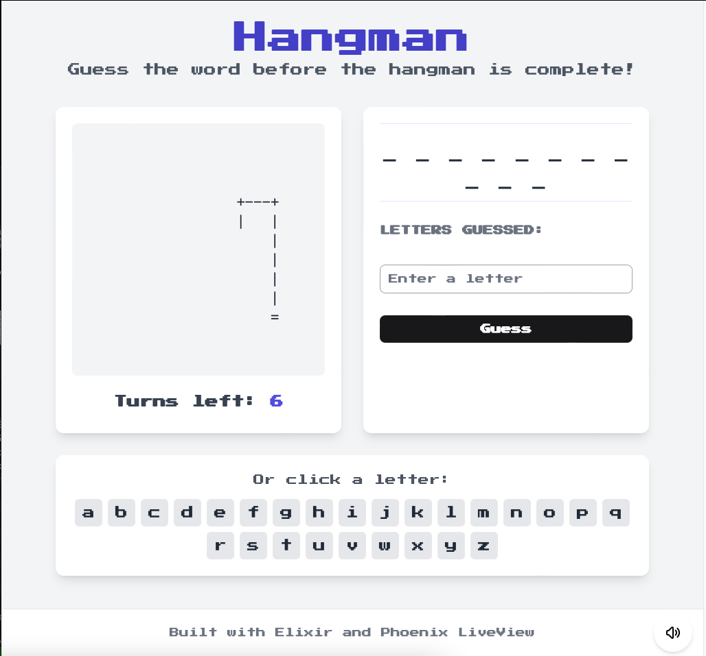

# Elixir Hangman Game

A classic hangman game built with Elixir and Phoenix LiveView. This project demonstrates functional programming concepts and real-time web interactions without writing JavaScript.



## Features

- Interactive gameplay with real-time updates
- Multiple difficulty levels (Easy, Medium, Hard)
- Virtual keyboard for easy letter selection
- Sound effects for correct/incorrect guesses
- Animations for game interactions
- Responsive design for desktop and mobile
- Mute/unmute toggle for sound effects
- Extensive word list with over 200 words

## Technology Stack

- **Elixir** - Functional programming language
- **Phoenix Framework** - Web framework for Elixir
- **Phoenix LiveView** - Real-time server-rendered HTML
- **Tailwind CSS** - Utility-first CSS framework

## Game Rules

1. Select a difficulty level:
   - Easy: 3-5 letter words
   - Medium: 6-8 letter words
   - Hard: 9+ letter words
2. The game selects a random word based on the chosen difficulty
3. Players guess one letter at a time
4. Correct guesses reveal the letter in the word
5. Incorrect guesses add to the hangman drawing
6. Players win by guessing all letters before the hangman is complete
7. Players lose if the hangman drawing is completed (6 incorrect guesses)

## Installation

### Prerequisites

- Elixir 1.14 or later
- Phoenix 1.7.x
- Node.js & npm

### Setup

1. Clone the repository
```bash
git clone https://github.com/yourusername/elixir-hangman.git
cd elixir-hangman
```

2. Install dependencies
```bash
mix deps.get
cd assets && npm install && cd ..
```

3. Start the Phoenix server
```bash
mix phx.server
```

4. Visit [`localhost:4000`](http://localhost:4000) in your browser

## Project Structure

- `lib/hangman/game.ex` - Core game logic module
- `lib/hangman/games.ex` - Game context module
- `lib/hangman/word_list.ex` - Word management with difficulty levels
- `lib/hangman_web/live/game/show.ex` - LiveView controller
- `lib/hangman_web/live/game/show.html.heex` - LiveView template
- `assets/js/hangman_hooks.js` - JavaScript hooks for sound effects
- `assets/css/app.css` - Custom CSS and animations

## Learning Resources

This project demonstrates several important aspects of Elixir and Phoenix:

- Functional programming with immutable data structures
- Pattern matching and recursion
- LiveView for interactive UIs without JavaScript
- Event handling and state management
- Animation and sound integration
- Dynamic difficulty levels

## Testing

Run the test suite with:

```bash
mix test
```

The project includes tests for:
- Game logic

## Future Enhancements

Some ideas for further development:

- Timer mode
- Two-player mode
- Word categories (Animals, Food, Technology, etc.)
- Leaderboard
- Hint system
- Custom word lists

## License

This project is licensed under the MIT License - see the LICENSE file for details.

## Acknowledgments

- Phoenix Framework team for the excellent LiveView library
- Tailwind CSS for the styling utilities

---

Feel free to contribute to this project by submitting pull requests or reporting issues. Happy coding!